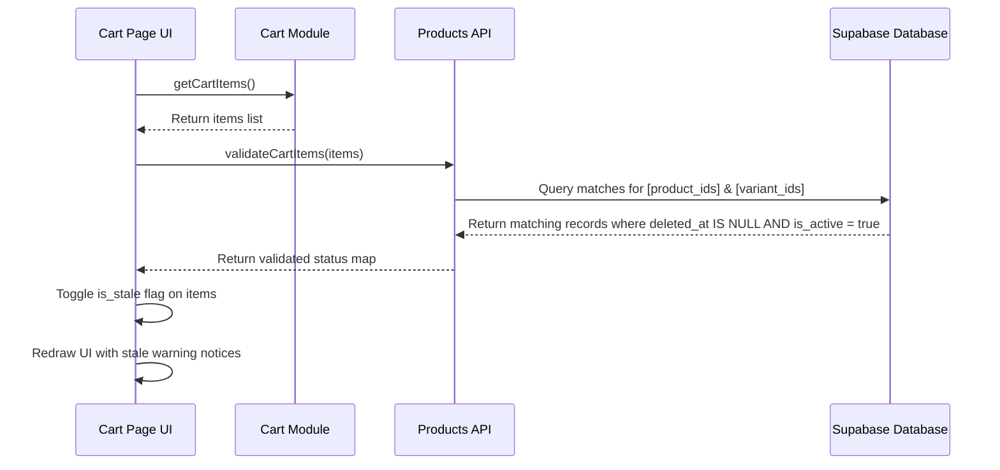

# Cart State Contract (localStorage)

**Branch**: `001-house-ecommerce-store` | **Date**: 2026-07-14

This contract specifies how the client-side guest cart state is represented, stored, and managed in the visitor's local browser storage. Since there are no customer accounts, the shopping experience relies fully on client-side state reliability.

---

## 1. Storage Keys
The cart state MUST be stored under a single localized namespace key:
- Namespace key: `bayt_al_ezz_cart`

---

## 2. Item Schema Definition

The cart is represented as a JSON array of objects. Each object conforms to the following schema:

```typescript
interface CartItem {
  product_id: string;      // UUID reference to parent product
  variant_id: string;      // UUID reference to product_variant (or parent UUID if default)
  product_name: string;    // Cached Arabic parent name (to display offline)
  variant_label: string;   // Cached variant name (e.g. "أحمر" or "افتراضي")
  price: number;           // Calculated unit price (price_override ?? base_price) at time of add
  quantity: number;        // Selected quantity (minimum 1)
  variant_image: string;   // Image URL for thumbnail display
  is_stale?: boolean;      // Boolean flag indicating if item has been deactivated/deleted
}
```

---

## 3. Cart Operations Interface (`src/js/cart.js`)

The cart manager module exposes pure logical methods for reading and writing to the storage array.

### `getCartItems()`
Retrieves the array of items parsed from `localStorage`.
- **Parameters**: None
- **Return Type**: `Array<CartItem>`
- **Behavior**: If key does not exist or JSON parsing fails, returns empty array `[]`.

### `addToCart(productId, variantId, label, price, image, name)`
Adds an item or increments its quantity if the same variant key already exists.
- **Parameters**:
  - `productId` (`string`): Parent product UUID
  - `variantId` (`string`): Specific variant UUID (use parent ID if default variant)
  - `label` (`string`): e.g. `"افتراضي"` or `"أخضر"`
  - `price` (`number`): Whole number unit price
  - `image` (`string`): URL of primary image
  - `name` (`string`): Arabic name of product
- **Return Type**: `Array<CartItem>` (returns updated list)

### `updateQuantity(variantId, newQuantity)`
Modifies the quantity of an item.
- **Parameters**:
  - `variantId` (`string`): Target variant UUID
  - `newQuantity` (`number`): Integer >= 1. If 0 or less, the item should be removed instead.
- **Return Type**: `Array<CartItem>`

### `removeFromCart(variantId)`
Removes the target variant item from the cart array.
- **Parameters**:
  - `variantId` (`string`): Target variant UUID to delete
- **Return Type**: `Array<CartItem>`

### `clearCart()`
Wipes the cart array from memory and local storage.
- **Parameters**: None
- **Return Type**: `void`

### `calculateCartTotals(items)`
Pure function (Testable Pure Logic Principle) to calculate pricing stats.
- **Parameters**:
  - `items` (`Array<CartItem>`): Cart items array
- **Return Type**:
  ```javascript
  {
    subtotal: 750,      // Sum of active items (excluding stale items)
    itemCount: 3,       // Total active units count
    hasStaleItems: true // True if any is_stale = true
  }
  ```

---

## 4. Stale Item Validation Algorithm

When a visitor loads `cart.html`, the application must validate that the items stored locally are still valid for sale.



### Stale Condition Rules
An item is marked `is_stale = true` if:
1. The parent product ID is not found in the DB (hard/soft deleted).
2. The parent product is marked `is_active = false`.
3. The variant ID is not found under that product.
4. The variant is marked `is_in_stock = false`.

### Handling Stale Items at Checkout
- Stale items are displayed in the cart with an Arabic alert ("المنتج ده مبقاش متاح").
- Stale items MUST be excluded from the running total.
- Stale items MUST NOT be included in the WhatsApp order message string.
- Stale items cannot have their quantity adjusted; they can only be removed.
