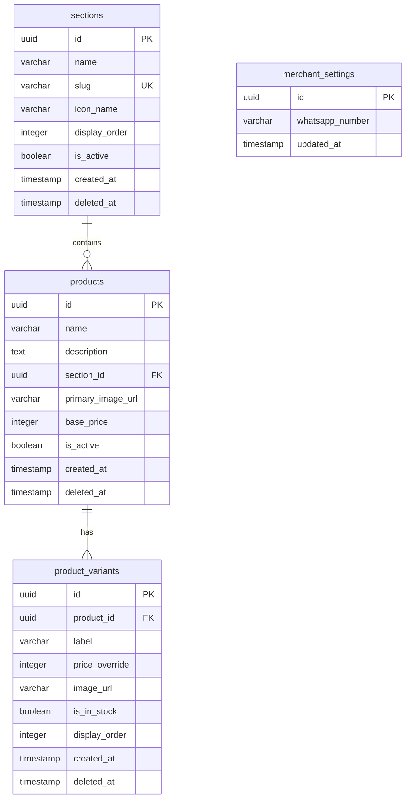

# Data Model: House-Concept E-commerce Store

**Branch**: `001-house-ecommerce-store` | **Date**: 2026-07-14

## Entity Relationship Diagram



---

## 1. Table Schemas

### Table: `merchant_settings`
Stores configuration fields for the single-merchant shop. Should contain exactly one row.

| Column Name | Data Type | Constraints | Default | Description |
|---|---|---|---|---|
| `id` | `uuid` | `PRIMARY KEY` | `gen_random_uuid()` | Unique settings row identifier |
| `whatsapp_number` | `varchar` | `NOT NULL` | - | E.164 format phone number (e.g. `201001234567`) |
| `updated_at` | `timestamp` | `NOT NULL` | `now()` | Last modification time |

---

### Table: `sections`
Maps to the 12 clickable room-sections on the house homepage.

| Column Name | Data Type | Constraints | Default | Description |
|---|---|---|---|---|
| `id` | `uuid` | `PRIMARY KEY` | `gen_random_uuid()` | Unique section ID |
| `name` | `varchar` | `NOT NULL` | - | Arabic name displayed on hover/label (e.g. `الغسالة`) |
| `slug` | `varchar` | `UNIQUE, NOT NULL` | - | URL-safe identifier mapping to SVG room id |
| `icon_name` | `varchar` | `NOT NULL` | - | Reference name of the flat icon file in Storage |
| `display_order` | `integer` | `NOT NULL` | `0` | Order index (0 to 11) for house positioning |
| `is_active` | `boolean` | `NOT NULL` | `true` | Visibility toggle for storefront |
| `created_at` | `timestamp` | `NOT NULL` | `now()` | Audit timestamp |
| `deleted_at` | `timestamp` | `NULLABLE` | `null` | Soft-delete timestamp (null = not deleted) |

---

### Table: `products`
Holds parent listings for grouped items.

| Column Name | Data Type | Constraints | Default | Description |
|---|---|---|---|---|
| `id` | `uuid` | `PRIMARY KEY` | `gen_random_uuid()` | Unique parent product ID |
| `name` | `varchar` | `NOT NULL` | - | Arabic product title |
| `description` | `text` | `NOT NULL` | - | Detailed Arabic description |
| `section_id` | `uuid` | `FOREIGN KEY` references `sections(id)` | - | Category assignment |
| `primary_image_url`| `varchar` | `NOT NULL` | - | Main thumbnail used in category grid |
| `base_price` | `integer` | `NOT NULL` | - | Default price in Egyptian Pounds (whole numbers) |
| `is_active` | `boolean` | `NOT NULL` | `true` | Visibility toggle for storefront |
| `created_at` | `timestamp` | `NOT NULL` | `now()` | Used for "newest first" default sorting |
| `deleted_at` | `timestamp` | `NULLABLE` | `null` | Soft-delete timestamp (null = not deleted) |

---

### Table: `product_variants`
Holds individual versions (e.g., color/pattern options) under a parent product.

| Column Name | Data Type | Constraints | Default | Description |
|---|---|---|---|---|
| `id` | `uuid` | `PRIMARY KEY` | `gen_random_uuid()` | Unique variant ID |
| `product_id` | `uuid` | `FOREIGN KEY` references `products(id)` ON DELETE CASCADE | - | Reference to parent product |
| `label` | `varchar` | `NOT NULL` | - | Variant selection label (e.g., `أزرق`, `رقعة خشبية`) |
| `price_override` | `integer` | `NULLABLE` | `null` | Override price in EGP. If null, inherits `products.base_price` |
| `image_url` | `varchar` | `NULLABLE` | `null` | Image specific to this variant. If null, inherits `products.primary_image_url` |
| `is_in_stock` | `boolean` | `NOT NULL` | `true` | Stock availability toggle |
| `display_order` | `integer` | `NOT NULL` | `0` | Order index inside product detail page switcher |
| `created_at` | `timestamp` | `NOT NULL` | `now()` | Audit timestamp |
| `deleted_at` | `timestamp` | `NULLABLE` | `null` | Soft-delete timestamp (null = not deleted) |

---

## 2. Supabase Storage Buckets

Create a public bucket named `store-assets`.

### Folder Structure
- `icons/`: Store the flat icons for the 12 rooms (SVG/PNG).
- `sections/`: Section-specific banner or custom artwork uploads.
- `products/`: Product and variant images uploaded via the admin panel.

### Upload Constraints
- File sizes MUST be validated client-side (max 2MB) or compressed via `image-compressor.js` before being submitted.
- Allowed extensions: `.jpg`, `.jpeg`, `.png`, `.webp`.

---

## 3. Row-Level Security (RLS) Policies

Enable Row-Level Security on all database tables.

### Read Policies (Storefront & Anonymous Users)
- **`merchant_settings`**: `SELECT` allowed for `anon` and `authenticated` roles (anyone can read settings to get the WhatsApp phone number).
- **`sections`**: `SELECT` allowed for `anon` where `deleted_at IS NULL AND is_active = true`.
- **`products`**: `SELECT` allowed for `anon` where `deleted_at IS NULL AND is_active = true`.
- **`product_variants`**: `SELECT` allowed for `anon` where `deleted_at IS NULL`. (Parent visibility controls storefront presence; variant state filters stock status).

### Write Policies (Admin Panel Users)
- **All tables**: `INSERT`, `UPDATE`, and `DELETE` policies restrict operations to `authenticated` users only (requiring valid Supabase Auth session).
- **Storage bucket `store-assets`**:
  - Read: Public access.
  - Write/Upload: Restricted to `authenticated` users only.

---

## 4. Performance Indexes

Create the following database indexes to optimize storefront speed:

```sql
-- Speed up category listing filters
CREATE INDEX idx_products_section_active_deleted ON products (section_id) 
WHERE deleted_at IS NULL AND is_active = true;

-- Optimize newest-first default sorting on category listing
CREATE INDEX idx_products_created_sort ON products (created_at DESC);

-- Speed up variant searches by product id
CREATE INDEX idx_variants_product ON product_variants (product_id) 
WHERE deleted_at IS NULL;

-- Optimize section fetches by unique slug
CREATE INDEX idx_sections_slug ON sections (slug) 
WHERE deleted_at IS NULL AND is_active = true;
```

---

## 5. Seed Data SQL

Run the following script to initialize the 12 room-sections and standard merchant settings:

```sql
-- Initialize settings
INSERT INTO merchant_settings (id, whatsapp_number)
VALUES ('00000000-0000-0000-0000-000000000001', '201000000000');

-- Seed 12 sections
INSERT INTO sections (name, slug, icon_name, display_order, is_active) VALUES
('الغسالة', 'laundry', 'washing-machine.svg', 0, true),
('رفايع المطبخ', 'kitchen-shelving', 'kitchen-shelf.svg', 1, true),
('ورقيات', 'paper-goods', 'foil-roll.svg', 2, true),
('بيت الراحة', 'bathroom', 'toilet.svg', 3, true),
('نص الدنيا', 'women', 'female-head.svg', 4, true),
('جنتلمان', 'men', 'razor.svg', 5, true),
('الريسبشن', 'reception', 'reception-bell.svg', 6, true),
('بيبي زون', 'baby', 'baby-bottle.svg', 7, true),
('الجزامة', 'footwear', 'shoe.svg', 8, true),
('التسريحة', 'vanity', 'vanity-brush.svg', 9, true),
('الجراج', 'garage', 'garage-door.svg', 10, true),
('منظفات', 'cleaning', 'spray-bottle.svg', 11, true);
```

---

## 6. Client-Side Cart Schema (localStorage)

The cart is saved in `localStorage` under the key `bayt_al_ezz_cart` as a JSON string representing an array of items.

### JSON Structure Example
```json
[
  {
    "product_id": "8b5e683c-62de-42e1-893c-df7e04ef4c09",
    "variant_id": "c1f7b880-994c-47bc-ad7e-001258d4a991",
    "product_name": "طقم ملايات تركي",
    "variant_label": "أزرق سماوي",
    "price": 350,
    "quantity": 2,
    "variant_image": "https://[project-id].supabase.co/storage/v1/object/public/store-assets/products/bedsheet_blue.webp",
    "is_stale": false
  },
  {
    "product_id": "2d1c67d3-ff00-4b47-baee-1cfa45d629a8",
    "variant_id": "2d1c67d3-ff00-4b47-baee-1cfa45d629a8", 
    "product_name": "مفرش مطبخ مقاوم للحرارة",
    "variant_label": "افتراضي",
    "price": 120,
    "quantity": 1,
    "variant_image": "https://[project-id].supabase.co/storage/v1/object/public/store-assets/products/kitchen_mat.webp",
    "is_stale": false
  }
]
```
*(Note: Products without variants copy their parent ID to the `variant_id` field and set `variant_label` to `"افتراضي"`).*
