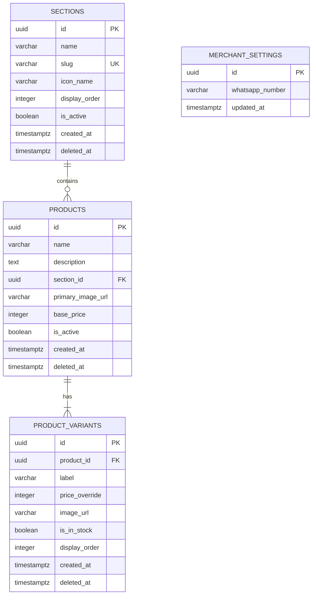

# Data Model: V2 Storefront Upgrade

This document specifies the database schema, table relationships, constraints, validation rules, and Row-Level Security (RLS) policies for the Bayt Al-Ezz storefront upgrade.

---

## 1. Entities & Database Schema

### `sections` Table
Represents shopping categories/rooms mapped to homepage zones.

| Column | Type | Nullable | Constraints & Defaults | Description |
|--------|------|----------|------------------------|-------------|
| `id` | `uuid` | NO | `primary key`, `default gen_random_uuid()` | Unique section ID |
| `name` | `varchar` | NO | `check (char_length(name) > 0)` | Arabic section name |
| `slug` | `varchar` | NO | `unique`, `check (char_length(slug) > 0)` | URL path and homepage identifier |
| `icon_name` | `varchar` | NO | `check (char_length(icon_name) > 0)` | Filename of extracted SVG in `/assets/icons/` |
| `display_order` | `integer` | NO | `default 0` | Ordering index in listings |
| `is_active` | `boolean` | NO | `default true` | Toggle to hide/show storefront overlay |
| `created_at` | `timestamptz`| NO | `default now()` | Timestamp of creation |
| `deleted_at` | `timestamptz`| YES | `default null` | Timestamp for soft-delete |

---

### `products` Table
Represents products listed in the store.

| Column | Type | Nullable | Constraints & Defaults | Description |
|--------|------|----------|------------------------|-------------|
| `id` | `uuid` | NO | `primary key`, `default gen_random_uuid()` | Unique product ID |
| `name` | `varchar` | NO | `check (char_length(name) > 0)` | Product name |
| `description` | `text` | NO | `default ''` | Product description |
| `section_id` | `uuid` | NO | `references sections(id)` | Parent section |
| `primary_image_url`| `varchar` | YES | `default null` | URL to primary product image (Optional in v2) |
| `base_price` | `integer` | NO | `check (base_price >= 0)` | Base price in Egyptian Pounds (EGP) |
| `is_active` | `boolean` | NO | `default true` | Active toggle for visibility |
| `created_at` | `timestamptz`| NO | `default now()` | Creation timestamp |
| `deleted_at` | `timestamptz`| YES | `default null` | Soft-delete timestamp |

---

### `product_variants` Table
Represents specific SKU attributes like colors, sizing, or styling.

| Column | Type | Nullable | Constraints & Defaults | Description |
|--------|------|----------|------------------------|-------------|
| `id` | `uuid` | NO | `primary key`, `default gen_random_uuid()` | Unique variant ID |
| `product_id` | `uuid` | NO | `references products(id) on delete cascade` | Parent product |
| `label` | `varchar` | NO | `check (char_length(label) > 0)` | Attribute label (e.g. "أزرق - L") |
| `price_override`| `integer` | YES | `check (price_override >= 0)`, `default null`| Override price (inherits `base_price` if null) |
| `image_url` | `varchar` | YES | `default null` | Variant-specific image (Optional) |
| `is_in_stock` | `boolean` | NO | `default true` | In stock status toggle |
| `display_order` | `integer` | NO | `default 0` | Ordering index |
| `created_at` | `timestamptz`| NO | `default now()` | Creation timestamp |
| `deleted_at` | `timestamptz`| YES | `default null` | Soft-delete timestamp |

---

### `merchant_settings` Table
Holds general configuration values.

| Column | Type | Nullable | Constraints & Defaults | Description |
|--------|------|----------|------------------------|-------------|
| `id` | `uuid` | NO | `primary key`, `default gen_random_uuid()` | ID (Fixed to single record in system) |
| `whatsapp_number`| `varchar` | NO | `check (char_length(whatsapp_number) >= 10)` | WhatsApp target (starts with country code) |
| `updated_at` | `timestamptz`| NO | `default now()` | Last update timestamp |

---

## 2. Table Relationships

---

## 3. Validation Rules

### Storefront Validation
- **Display Limit**: The storefront homepage only displays sections up to the first 12 records ordered by `display_order`. Admin forms should prevent creating/activating a 13th section unless an existing one is inactivated or deleted.
- **Arabic Character Support**: Names for sections, products, and variants must accept Arabic characters.
- **Optional Images**: Products and variants allow nullable image fields. If a URL is missing (`null`), the frontend must automatically assign a fallback to the static SVG: `/public/assets/placeholder.svg`.

### Database Constraints
- Strings must have `char_length > 0` (no empty white space strings).
- Prices must be >= 0.

---

## 4. Row-Level Security (RLS) Policies

All tables have RLS enabled.

### Public Storefront Client
- **Rule**: Can read active and non-deleted records only. Cannot insert, update, or delete.
- `sections`: `SELECT USING (deleted_at IS NULL AND is_active = true)`
- `products`: `SELECT USING (deleted_at IS NULL AND is_active = true)`
- `product_variants`: `SELECT USING (deleted_at IS NULL AND product_id IN (SELECT id FROM products WHERE deleted_at IS NULL AND is_active = true))`
- `merchant_settings`: `SELECT USING (true)`

### Authenticated Admin Client (Merchant)
- **Rule**: Full CRUD access when authenticated.
- `sections`: `ALL TO authenticated USING (true) WITH CHECK (true)`
- `products`: `ALL TO authenticated USING (true) WITH CHECK (true)`
- `product_variants`: `ALL TO authenticated USING (true) WITH CHECK (true)`
- `merchant_settings`: `ALL TO authenticated USING (true) WITH CHECK (true)`
